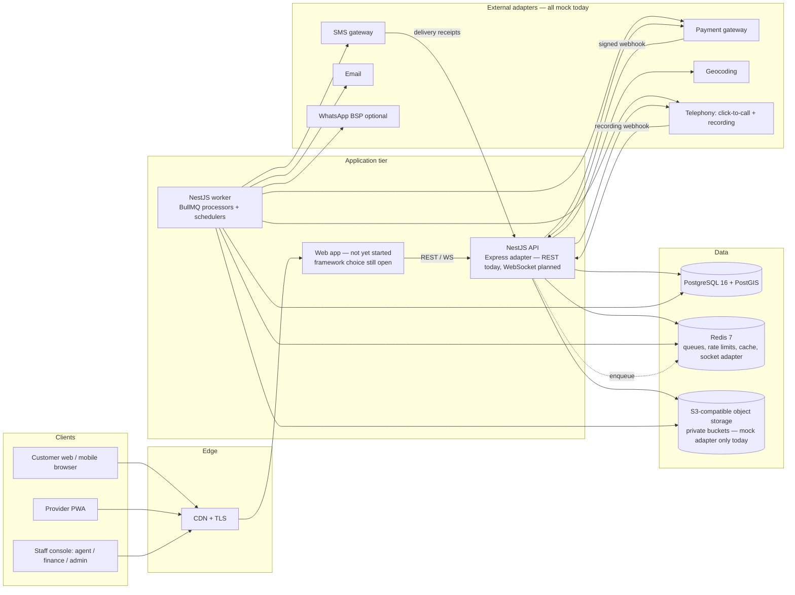

# Technical Requirements & Design Document (TRD) — Smart Home Maintenance Services

| Field | Detail |
|---|---|
| Version | 1.1 — corrected against the running codebase, 2026-09-28 |
| Implements | `SRS.md` (this folder) |
| Data model | `ERD.md` (this folder), `schema.sql` |
| Audience | Engineers, reviewers, QA, DevOps, and any AI coding agent working on this repo |

This document is the engineering contract. Where the SRS says *what*, this says *how*, and
records why each choice was made (§24 Decision Log). Where the two disagree, the SRS wins
and this document must be corrected.

**This is a corrected copy of `smart-home-docs/02_TRD.md`.** That original was written
before the backend existed and describes the intended design end to end (frontend included).
Most of it — the state machine, ledger, verification engine, conduct engine, API catalogue,
security model, ADRs — is unchanged, because it's still the design being built toward and
none of it was framework-specific. Only the parts tied to a specific tool choice have been
corrected here to match what's actually running: §2 (stack), §3 (repo layout), and the
CI/CD details in §21. See **§0 Implementation Status** below for what's actually built today
versus still planned — that distinction lives in `PROGRESS_TRACKER.md` and
`TASKS_BACKEND.md`/`TASKS_FRONTEND.md` (this folder) going forward, not in this document.

---

## 0. Implementation status (read this first)

Only the backend exists today, and only part of it. As of 2026-09-28:

- **Built:** identity/auth (M2, M3, M12-auth), catalogue (M1), places, customer addresses,
  provider profile/availability/service-areas, provider approval admin, search & ranking (M4),
  booking creation/read (M5, no state-machine transitions past creation yet), a payment webhook
  receiver, an outbox dispatcher, settings, audit, health checks, and mock adapters for every
  external integration (payment/SMS/email/maps/telephony/WhatsApp/storage).
- **Not built:** execution & evidence (M6), the verification engine (M7), the ledger and
  payouts (M8 beyond the webhook receiver), ratings (M9), complaints/disputes (M10),
  notifications content (M11, though bilingual en/ur templates are already seeded), conduct
  & penalties (M15), maintenance plans (M13), reporting (M14), the frontend (all of §15), and
  realtime/WebSocket (§1, §14.2 "Realtime" row).
- **Ground truth for "is X built":** `PROGRESS_TRACKER.md` in this folder, ticket by ticket.
  This TRD describes the target architecture; it does not track completion.

---

## 1. Architecture Overview



**Style:** modular monolith. One deployable API and one worker, each its own npm workspace
app (`apps/api`, `apps/worker`) but sharing the same feature/service code, not a duplicated
codebase — see §3's note on how the split is actually wired. Each domain module owns its
tables. Modules talk through application services and domain events, never through each
other's repositories. This keeps the system simple to run for a single team while leaving
clean seams to extract services later.

**Three non-negotiable cores** (everything else is conventional CRUD):
1. **Booking state machine** — the only writer of `bookings.status` (§5).
2. **Ledger** — the only writer of money (§6).
3. **Verification engine** — the only path to release (§9).

---

## 2. Technology Stack

*Corrected against `apps/api/package.json`, `apps/worker/package.json`, root `package.json`,
and this session's platform-migration work. Rows marked "planned" are unchanged from the
original design and not yet built.*

| Layer | Choice | Notes |
|---|---|---|
| Language | TypeScript 5 (strict) everywhere | Unchanged. |
| Monorepo | **npm workspaces** (plain — no Turborepo) | Turborepo was removed; root scripts run `npm run <task> --workspaces --if-present`, each prefixed with a build pass since npm workspaces has no dependency-graph build cache of its own. |
| Web | *Planned, not started* | Framework choice (Next.js or otherwise) is still open. |
| API | **NestJS 11 on Express** (`@nestjs/platform-express`), not Fastify | Express was substituted for Fastify mid-build; see the Decision Log addendum in §24. |
| Validation (API) | **Zod schemas validated manually** (`parseWith()` against a `*.schemas.ts` Zod schema per handler, `@Body() body: unknown` on the controller signature) + a custom `@ApiZodBody()` decorator that derives the OpenAPI request-body schema from the same Zod schema | Not `nestjs-zod`. `packages/contracts` still holds the shared enums/DTOs/error codes/money/pagination/problem-details types the frontend will build against. |
| ORM / migrations | Prisma 6 as the **client only** (`prisma db pull` → `generate`) + **dbmate** for plain-SQL migrations | Unchanged — this was correct in the original TRD and still is. Never run `prisma migrate`. |
| DB | PostgreSQL 16 + PostGIS 3 | Unchanged. |
| Queue / scheduler | BullMQ 5 on Redis 7 | Unchanged. |
| Realtime | *Planned, not started* | Socket.IO as originally specified; no realtime code exists yet. |
| Object storage | *Mock adapter only* | MinIO was removed from `infra/docker-compose.yml` this session — nothing in the running system ever connected to it (`STORAGE_PROVIDER` is pinned to `mock`). Reinstate MinIO/S3 when a real `ObjectStorage` adapter is built. |
| Auth | Argon2id, JWT access (15 min) + rotating refresh token (httpOnly cookie), TOTP for staff | Unchanged, and built. |
| PDFs / Excel | *Planned, not built* | `pdfmake`, `exceljs` as originally specified — needed starting with M14 Reporting. |
| Logging | **A custom `JsonLogger`** (`apps/api/src/logger.ts`), implementing Nest's `LoggerService`, not Pino | Pino was removed this session. Emits the same one-JSON-object-per-line shape and the same redaction paths (`common/redaction.ts`) Pino was configured with, so log shipping/dashboards keep working. Sentry is not wired up. |
| Testing | **Vitest** for unit and integration alike; integration tests run against **real Docker Compose containers** (`infra/docker-compose.yml`, `postgis` + `redis`), not Testcontainers; HTTP is exercised via `light-my-request` injecting straight into the Express handler (not `supertest` — real TCP made the single vitest worker crash intermittently on Windows) | Playwright/k6 remain unbuilt (no frontend, no load-test target yet). |
| CI/CD | GitHub Actions (`.github/workflows/backend.yml`) — lint/typecheck/unit/build as one job, integration tests (real Postgres/Redis service containers) as another, a schema-fidelity check as a third | No Docker image build/push yet. |
| Runtime | Node.js 22, Docker (for Postgres/Redis only — the app itself isn't containerized yet) | |

## 3. Repository Layout

*Corrected against the actual tree. The biggest structural difference from the original: no
`src/modules/` nesting, and the worker is a real second workspace, not a second entrypoint
file inside `apps/api`.*

```
smart-home-maintenance-service/
├─ apps/
│  ├─ api/                    # NestJS + Express — the HTTP application
│  │  ├─ src/
│  │  │  ├─ identity/ catalogue/ places/ customer/ provider/
│  │  │  ├─ search/ booking/
│  │  │  ├─ platform/         # settings, audit, outbox dispatcher, payment webhook
│  │  │  ├─ integrations/     # mock adapters for every external system + dev inbox
│  │  │  ├─ queues/           # BullMQ queue registry
│  │  │  ├─ database/         # Prisma + Redis modules
│  │  │  ├─ config/           # environment schema/service
│  │  │  ├─ health/
│  │  │  ├─ common/           # guards, interceptors, filters, policy, idempotency, swagger helpers
│  │  │  ├─ app.module.ts, main.ts, http-app.ts, adapter.ts
│  │  │  └─ (no worker.ts — see apps/worker)
│  │  ├─ test/                # unit + integration (real containers, not Testcontainers)
│  │  ├─ scripts/api-surface.ts   # snapshots the OpenAPI operation list for regression-proofing refactors
│  │  └─ package.json          # declares `exports` for the handful of things apps/worker imports
│  └─ worker/                  # NestJS standalone app — its own workspace, thin
│     ├─ src/worker.ts         # imports AppModule + a few services from @smart-home/api's build output
│     └─ package.json
├─ packages/
│  ├─ contracts/               # zod schemas, DTOs, enums, error codes, money, pagination, problem+json (shared)
│  ├─ domain/                  # PURE logic: clock, money, booking transitions, SLA calendar — no I/O
│  │                           # kept as its own workspace on purpose: apps/api and apps/worker both need
│  │                           # these helpers without depending on each other
│  └─ db/                      # prisma/schema.prisma, migrations/ (dbmate), seed/
├─ infra/                      # docker-compose.yml (postgis, redis only — MinIO/Mailpit removed)
├─ docs-final/                 # ← you are here. The ONLY docs folder — one doc of record per artifact.
│  └─ archive/                 # superseded/historical docs, kept for reference — see docs-final/README.md
└─ .github/workflows/          # CI
```

There used to be two more top-level doc folders (`smart-home-docs/`, `docs/`) — that split was
the original problem `docs-final/` was created to fix (see §24 ADR 017). Both are gone now:
everything still load-bearing moved into `docs-final/` itself (including `schema.sql`, which
briefly stayed at `smart-home-docs/04_schema.sql` for one day because three code paths
hardcoded it — see ADR 018), and everything superseded moved into `docs-final/archive/`.

Not yet present, still planned: `apps/web` (frontend), `packages/ui`, `packages/integrations`
as its own package (integrations currently live as a module inside `apps/api`, fine while only
`apps/api` needs them — revisit if `apps/worker` ever needs the same adapters directly),
`e2e/` (Playwright).

**Rule (unchanged):** `packages/domain` has zero dependencies on Nest, Prisma or Node APIs.
All business rules that can be expressed as pure functions live there and are unit-tested
exhaustively. Services in `apps/api` orchestrate: load → call domain → persist → emit.

**How the API/worker split actually works:** `apps/worker` does not duplicate `apps/api`'s
code. `apps/api/package.json` declares an `exports` map exposing exactly what the worker
needs off `apps/api`'s *build output* (`./app.module`, `./config/environment.service`,
`./platform/outbox.dispatcher`, `./platform/settings.service`, `./queues/queue.registry`).
`apps/worker/src/worker.ts` imports those and boots the same `AppModule` via
`NestFactory.createApplicationContext` (no HTTP listener). This means `apps/api` must be
built before `apps/worker` — the root `workspaces` array order enforces that. The tradeoff:
`apps/worker` transitively pulls in `@nestjs/platform-express`/`helmet`/etc. through
`@smart-home/api`, which is harmless (the worker never touches HTTP) but not a clean
dependency boundary. Revisit by extracting a shared `packages/app-core` if that ever matters.

---

## 4. Backend Module Map

*Unchanged from the original — this is the target, not a completion tracker. Cross-reference
`PROGRESS_TRACKER.md` for what's actually built. One correction: the "Nest module" column
names now match the real directory names (flat, no `modules/` prefix, and some renamed).*

| Nest module (`apps/api/src/<name>`) | SRS module | Owns tables (see ERD) | Key services |
|---|---|---|---|
| identity | M2/M3/M12 | users, roles, permissions, role_permissions, user_roles, sessions, otp_codes | AuthService, OtpService, SessionService |
| catalogue | M1 | categories, services, service_checklist_items, commission_rules | CatalogueService, PricingService |
| places | — | cities, areas | — |
| customer | M2 | addresses, favourites | AddressesService |
| provider | M3 | providers, provider_documents, provider_services, provider_service_areas, provider_availability, provider_time_off, provider_payout_accounts | ApprovalService, AvailabilityService |
| search | M4 | (read models) | SearchService, RankingService |
| booking | M5 | bookings, booking_offers, booking_status_history, booking_attachments, messages | BookingStateService (transitions not yet built beyond creation) |
| *execution — planned* | M6 | job_evidence, job_checklist_results, quote_revisions, booking_items, invoices | EvidenceService, InvoiceService, GeofenceService |
| *verification — planned* | M7 | verification_calls, verification_call_attempts, verification_links, verification_amendments, staff_conflicts | TierRouter, QueueService, ConsoleService, AutoReleaseService |
| *ledger — planned* | M8 | ledger_accounts, ledger_transactions, ledger_entries, account_balances | LedgerService (post), BalanceService |
| platform (payments slice built so far) | M8 | payments, payment_events, refunds, coupons, coupon_redemptions | PaymentWebhookController, OutboxDispatcher, SettingsService, AuditService |
| *payouts — planned* | M8 | payout_batches, payouts | PayoutService |
| *ratings — planned* | M9 | ratings, remarks, remark_replies, provider_stats | RatingService, ReputationProjector |
| *complaints — planned* | M10 | complaints, complaint_events, disputes | ComplaintService, DisputeService |
| *conduct — planned* | M15 | breach_types, penalties, demerit_awards, threshold_events, appeals, provider_flags | ConductService, DecayJob |
| *notifications — planned (templates already seeded)* | M11 | notifications, notification_templates, outbox_events | Dispatcher, TemplateRenderer |
| *plans — planned* | M13 | plans, plan_services, subscriptions, plan_visits | PlanScheduler |
| *reports — planned* | M14 | report_runs | ReportService |
| identity/provider (admin slices) | M12 | settings, audit_log | SettingsService (cached), AuditService |

---

## 5. Booking State Machine

*Unchanged design; **only booking creation is built today** — the transitions below are the
target, not current behaviour. `packages/domain/src/bookingTransitions.ts` exists with unit
tests but the full T1–T26 table and the effect handlers are not wired into `BookingStateService`
yet.*

### 5.1 Definition (`packages/domain`)
```ts
export type BookingEvent =
  | 'checkout_online' | 'checkout_cash' | 'payment_captured' | 'payment_timeout'
  | 'offer_declined' | 'offer_expired' | 'offers_exhausted' | 'accept' | 'confirm_schedule'
  | 'cancel_by_customer' | 'cancel_by_provider' | 'reschedule' | 'depart'
  | 'start_work' | 'report_no_show' | 'raise_revision' | 'approve_revision' | 'reject_revision'
  | 'complete' | 'enqueue_verification' | 'outcome_verified' | 'link_confirmed'
  | 'outcome_rework' | 'outcome_disputed' | 'auto_release' | 'rework_window_expired'
  | 'release' | 'resolve_release' | 'resolve_partial' | 'resolve_refund'
  | 'warranty_claim' | 'close';

export interface TransitionRule {
  from: BookingStatus[]; event: BookingEvent; to: BookingStatus;
  actors: ActorRole[];                       // CUSTOMER | PROVIDER | AGENT | FINANCE | ADMIN | SYSTEM
  guard?: (ctx: TransitionContext) => GuardResult;   // pure; returns {ok} | {ok:false, code}
}
export const TRANSITIONS: TransitionRule[] = [ /* exactly T1–T26 from SRS §6.2 */ ];
export function nextState(current, event, ctx): { to } | { error } { /* pure */ }
```
Transitions `ACCEPTED → SCHEDULED` and `WORK_COMPLETED → AWAITING_VERIFICATION` are *chained*: the service applies the follow-up system event in the same DB transaction, producing two history rows.

### 5.2 Execution (`apps/api` `BookingStateService.apply`)
```
BEGIN
  SELECT * FROM bookings WHERE id=$1 FOR UPDATE           -- serialise per booking
  result = domain.nextState(booking.status, event, ctx)    -- pure guard evaluation
  if error → ROLLBACK, throw 409 ILLEGAL_TRANSITION / 422 GUARD_FAILED(code)
  UPDATE bookings SET status=$to, version=version+1, ...side fields
  INSERT booking_status_history(...)
  run effect handlers registered for (from,to)             -- same txn: ledger posts, holds
  INSERT outbox_events(type='booking.transitioned', payload)
COMMIT
```
- **No other code path may `UPDATE bookings SET status`.** Enforced today by the shared
  `no-restricted-syntax` ESLint rule (`eslint.config.js`, root) with a proof test at
  `test/lint-fixtures.test.ts` — not yet also enforced by a DB trigger; add one when the
  full state machine lands.
- Effects that call external systems (SMS, gateway refunds) are **never** executed inside the
  transaction; they are outbox events processed by the worker.

### 5.3 Transactional outbox

**Built.** `outbox_events(id, aggregate, aggregate_id, type, payload, created_at, processed_at, attempts, last_error)`.
`apps/api/src/platform/outbox.dispatcher.ts` polls with `SELECT … FOR UPDATE SKIP LOCKED
LIMIT 100` and dispatches to BullMQ queues (`notifications`, `payments`, `verification`,
`projections`) — see `apps/api/test/integration/outbox.test.ts` for the concurrency proof
(two dispatchers racing over the same rows produce one job per row, no duplicates).

### 5.4 Idempotency

**Built.** Mutating endpoints accept an `Idempotency-Key` header. Stored in
`idempotency_keys(key, user_id, route, request_hash, response, created_at)` via
`apps/api/src/common/idempotency.service.ts` + `.interceptor.ts`; replays return the stored
response; the same key with a different body → 422. Gateway webhooks deduplicated by
`payment_events(provider, gateway_event_id)` UNIQUE — see `PaymentWebhookController`.

---

## 6. Ledger & Money

*Planned — not built. Kept verbatim from the original design.*

### 6.1 Principles
- Amounts are `BIGINT` paisa. Never floats. Helper `Money` type already exists in `packages/domain` and is unit-tested; the ledger tables and posting service that will use it are not yet built.
- Journal model: `ledger_transactions` (one business event) → `ledger_entries` (≥ 2 lines). A deferred constraint trigger asserts Σ(debit) = Σ(credit) per transaction at commit.
- Entries are insert-only. Corrections are reversing transactions (`reverses_transaction_id`).
- `account_balances` is maintained **only** by trigger on `ledger_entries` insert (no app writes; `REVOKE UPDATE` from app role except trigger function `SECURITY DEFINER`). Satisfies "derived, never editable" while keeping reads O(1). A nightly job recomputes from entries and alerts on drift.
- `LedgerService.post(txType, lines[], {bookingId, idempotencyKey})` is the only writer. It validates balance before insert.

### 6.2 Chart of accounts
| Account type | Owner | Normal side | Meaning |
|---|---|---|---|
| `GATEWAY_CLEARING` | platform | debit (asset) | Cash at/with the gateway |
| `ESCROW` | platform (dimension: booking) | credit (liability) | Customer money held for a booking |
| `PROVIDER_WALLET` | provider | credit (liability) | Owed to provider; negative = provider debt |
| `PLATFORM_COMMISSION` | platform | credit (revenue) | Commission earned |
| `PENALTY_INCOME` | platform | credit (revenue) | Fines retained |
| `CUSTOMER_COMPENSATION` | platform | debit (expense) | Goodwill/penalty pass-through to customer |
| `PROMO_EXPENSE` | platform | debit (expense) | Coupons/referral credits |
| `CUSTOMER_RECEIVABLE` | customer | debit (asset) | Unpaid cancellation fees (cash customers) |
| `PLAN_DEFERRED` | platform (dimension: subscription) | credit (liability) | Prepaid plan money not yet earned |
| `PAYOUT_CLEARING` | platform | credit | Payouts in flight to banks |

### 6.3 Posting recipes (D = debit, C = credit)
| Event | Lines |
|---|---|
| Online capture (checkout / top-up) | D `GATEWAY_CLEARING` a · C `ESCROW[b]` a |
| Release (online, amount f, commission k, coupon d) | D `ESCROW[b]` (f−d) · D `PROMO_EXPENSE` d · C `PROVIDER_WALLET[p]` (f−k) · C `PLATFORM_COMMISSION` (k−d)… *if k < d the shortfall is promo expense; provider always receives f−k* |
| Excess escrow refund at release (e = escrow − (f−d)) | D `ESCROW[b]` e · C `GATEWAY_CLEARING` e (+ gateway refund call) |
| Full/partial refund | D `ESCROW[b]` r · C `GATEWAY_CLEARING` r |
| Cash settlement (commission k) | D `PROVIDER_WALLET[p]` k · C `PLATFORM_COMMISSION` k |
| Late-cancel fee, online | D `ESCROW[b]` fee · C `PLATFORM_COMMISSION` fee; remaining escrow refunded |
| Late-cancel fee, cash | D `CUSTOMER_RECEIVABLE[c]` fee · C `PLATFORM_COMMISSION` fee |
| Penalty fine | D `PROVIDER_WALLET[p]` x · C `PENALTY_INCOME` x (or C `CUSTOMER_COMPENSATION` settlement when passed to customer) |
| Payout request approved | D `PROVIDER_WALLET[p]` a · C `PAYOUT_CLEARING` a |
| Payout confirmed paid | D `PAYOUT_CLEARING` a · C `GATEWAY_CLEARING` a |
| Provider pays debt online | D `GATEWAY_CLEARING` a · C `PROVIDER_WALLET[p]` a |
| Plan purchase | D `GATEWAY_CLEARING` a · C `PLAN_DEFERRED[s]` a |
| Plan visit release | D `PLAN_DEFERRED[s]` share · C `PROVIDER_WALLET[p]` (share−k) · C `PLATFORM_COMMISSION` k |

Commission `k = round_half_up(f × rate)` with the rate **snapshotted on the booking at checkout** (`commission_rate_bp`, basis points).

### 6.4 Derived views
- `v_provider_earnings`: held (Σ escrow of provider's bookings in pre-release states, provider share), releasable (wallet balance), paid (Σ payouts PAID), commission (Σ commission lines).
- Wallet balance < 0 and |balance| > `cash.debt_ceiling` → `providers.offer_blocked_reason = 'DEBT'` (set by projector, read by search/offer engine).

### 6.5 Payment flow (online)

**Partially built:** the webhook receiver (step 2) exists (`PaymentWebhookController`) and
verifies signatures + dedupes by `(gateway, gateway_event_id)`, but it doesn't yet drive
booking-state transitions or ledger posts — those depend on the ledger and booking-state-machine
work above. Steps 1, 3, 4 are not built.

1. `POST /bookings/checkout` (Idempotency-Key) → booking `PENDING_PAYMENT`, `payments` row `INITIATED`, gateway session created via adapter → returns `redirectUrl`/`clientToken`.
2. Gateway → `POST /webhooks/payments/:provider` → verify HMAC signature + timestamp tolerance (5 min) → insert `payment_events` (unique) → if new and `CAPTURED`: ledger capture + state `payment_captured` — **one DB transaction**.
3. Browser return URL only polls status; it never changes state.
4. `payment_timeout` delayed BullMQ job fires at `BR-05`; no-op if already captured.

---

## 7. Scheduling & Slot Locking

*Availability calendar (`FR-SP-07`) and service-area (`FR-SP-08`) are built. The slot generator,
the exclusion-constraint booking overlap guard, and auto-assign are not yet built — the DB
constraint below is unchanged design, not yet applied as a migration.*

- **Availability model:** weekly rules (`provider_availability`: weekday, start, end), exceptions (`provider_time_off`: tstzrange), and bookings. Slot generator (pure, in `domain`) produces slots of `service.expected_duration_min` rounded up to 30 min, plus `BR-08` travel buffer, in Asia/Karachi, for 14 days ahead.
- **Double-booking protection (database-level):**
```sql
ALTER TABLE bookings ADD CONSTRAINT no_provider_overlap
  EXCLUDE USING gist (provider_id WITH =, slot WITH &&)
  WHERE (status IN ('PENDING_PAYMENT','REQUESTED','ACCEPTED','SCHEDULED','EN_ROUTE','IN_PROGRESS','QUOTE_REVISION'));
```
`slot` is a `tstzrange` including the travel buffer. `PENDING_PAYMENT` is included in the constraint's status set, so an unpaid online checkout holds the slot until the `payments.timeout` job moves it to `ABANDONED` (≤ `BR-05` minutes); no separate holds table is needed. Insert conflict (`23P01`) → API returns `409 SLOT_TAKEN`, UI refreshes availability (UC-05 7b).
- **Auto-assign:** `provider_id` null, `requested_slot` set; `OfferService` queries ranked providers free for that slot and sends offers sequentially (one active offer at a time) via delayed jobs of `BR-01` minutes.

---

## 8. Search & Ranking

**Built** — `apps/api/src/search/`. The candidate query and ranking function below match
what's implemented, modulo exact column/weight names, which live in code, not this doc.

```sql
-- candidate set (parameterised)
SELECT p.id, ps.price_paisa,
       ST_Distance(p.base_location, a.location) AS distance_m,
       st.score, st.completion_rate, st.median_response_sec, st.last_active_at
FROM providers p
JOIN provider_services ps ON ps.provider_id=p.id AND ps.service_id=$service AND ps.status='APPROVED'
JOIN provider_stats st ON st.provider_id=p.id
JOIN addresses a ON a.id=$address
WHERE p.status='APPROVED' AND p.offer_blocked_reason IS NULL
  AND ST_DWithin(p.base_location, a.location, p.radius_m)
  AND EXISTS (SELECT 1 FROM provider_service_areas sa WHERE sa.provider_id=p.id AND sa.area_id=a.area_id)
  AND <optional filters>
```
Ranking computed in `domain.rankProviders()` on ≤ 200 candidates:
`score = w_r·norm(rating) + w_d·(1 − min(dist/radius,1)) + w_c·completion + w_s·(1 − min(resp/900s,1)) + w_a·recency_decay(last_active)`, weights from settings (`BR-60`). New providers without ratings get the neutral prior 3.5 (Bayesian: `(Σr + 3.5·5)/(n+5)`) so they aren't buried. Ties broken by provider id for determinism.

`provider_stats` is a projection table updated by the `projections` queue on rating/booking events (rating events not yet wired since ratings aren't built). Indexes: GiST on `providers.base_location`, `addresses.location`; btree on `(service_id, status)` in `provider_services`; `(city_id)`, `(area_id)`.

---

## 9. Verification Engine

*Planned — not built. Kept verbatim from the original design. `packages/domain/src/slaCalendar.ts`
exists and is unit-tested (the calling-hours SLA math this section depends on) but nothing in
`apps/api` consumes it yet.*

### 9.1 Tier routing (pure function)
```ts
routeTier(input: {
  providerVerifiedJobs: number; finalAmount: Paisa; service: {isHighRisk: boolean};
  anomalies: Anomaly[]; activeDemerits: number; priorConflict: boolean;
  hadRevisions: boolean; paymentMode: 'CASH'|'ONLINE'; rng: () => number; settings: TierSettings
}): { tier: 'A'|'B'; reasons: TierReason[] }
```
Rules R1–R10 (SRS §5.2). `rng` injected for deterministic tests. Reasons persisted on `verification_calls.routing_reasons` (text[]).

### 9.2 Queue
- On `enqueue_verification`: insert `verification_calls(status='QUEUED', tier, priority, sla_due_at)`. `priority = 0` cash, `1` others; `sla_due_at = SlaCalendar.addBusinessMinutes(completedAt, BR-11|BR-12)` (pure; pauses outside 08:00–22:00 PKT).
- **Claim:** `POST /agent/queue/claim` →
```sql
UPDATE verification_calls SET status='LOCKED', locked_by=$agent, locked_at=now()
WHERE id = (SELECT vc.id FROM verification_calls vc
            WHERE vc.status='QUEUED' AND vc.tier='A' AND vc.next_attempt_at <= now()
              AND NOT is_conflicted($agent, vc.booking_id)
            ORDER BY vc.priority, vc.sla_due_at FOR UPDATE SKIP LOCKED LIMIT 1)
RETURNING *;
```
- Lock sweeper returns `LOCKED` items idle > `BR-26` min to `QUEUED`.
- Outside calling hours the claim endpoint returns `423 OUTSIDE_CALLING_HOURS`.

### 9.3 Attempts & fallback
Each call attempt → `verification_call_attempts(result: ANSWERED|NO_ANSWER|BUSY|WRONG_PERSON|SWITCHED_OFF, band, duration, recording_ref)`. After a failed attempt, `next_attempt_at` = start of the next **different** band (or +2 h if same band still has ≥ 2 h and a different band has already been used). After attempt 3 fails (with ≥ 2 distinct bands) → create `verification_links` (hashed token, 6-digit OTP, expires at completion + 72 h), send SMS + WhatsApp via outbox.

### 9.4 Submission
`POST /agent/verifications/:id/submit` (Idempotency-Key) validates the questionnaire (zod), applies guard rules (SRS §5.4), then in one transaction: set questionnaire columns + `outcome` + `submitted_at` + `status='SUBMITTED'` → trigger freezes the row → booking event (`outcome_*`) → if release-permitting & online: ledger release + `release` event; create `ratings` + `remarks` (unless `AUTO_RELEASED`); if `VERIFIED_WITH_ISSUE`: complaint + provider flag. Amendments: `verification_amendments(verification_call_id, field, old, new, reason, admin_id)` — displays overlay the original; outcome amendments go through the dispute path.

### 9.5 Telephony
- **Mode A (click-to-call)**: `TelephonyAdapter.bridgeCall(agentEndpoint, customerPhone, {record:true, callerId: platformNumber})`; recording URL delivered by webhook → stored in private bucket, encrypted (SSE-KMS or app-level AES-GCM), `recording_ref` saved.
- **Mode B (manual dial)**: agent dials from desk phone, console records attempt result and optionally uploads the recording file. Used when OQ-04 is unresolved. Both modes produce identical records.
- Consent line displayed on console with "Consent read" checkbox (required before questionnaire unlocks).

### 9.6 Scheduled verification jobs
Auto-release sweep (every 5 min): `status IN (QUEUED, LOCKED)` and `completed_at + 72h ≤ now()` → system outcome `AUTO_RELEASED`. Tier B escalation (every 5 min): Tier B with no response ≥ 24 h → `tier='A'`, reason `B_ESCALATED`.

---

## 10. Execution & Evidence

*Planned — not built.*

- **Start OTP:** 6 digits, generated when booking becomes `SCHEDULED`, shown in customer app (and SMS on the slot day), stored hashed (`argon2` not needed — HMAC-SHA256 with server pepper), valid on slot date ±12 h, 5 tries then 15-min lock.
- **Geofence:** provider app sends `navigator.geolocation` fix with accuracy on start and complete; server computes `ST_Distance` to address; stores `checkin_at`, `checkin_distance_m`, `checkin_accuracy_m`. Anomaly if distance − accuracy > `BR-09`.
- **Uploads:** client compresses (browser-image-compression, ≤ 1600 px, JPEG q0.8), requests `POST /uploads/presign {bookingId, kind}` → presigned PUT (5 min) → PUT to S3 → `POST /evidence {key, kind, clientCapturedAt}`; server stamps `received_at` (authoritative), validates object exists, magic-byte type check, strips EXIF GPS from customer-visible copies via worker. Offline: evidence saved to IndexedDB queue; service worker Background Sync retries; every upload has a client UUID → server upsert by `(booking_id, client_uuid)` prevents duplicates (`FR-EX-12` — deferred, see `TASKS_BACKEND.md`'s FR-id reconciliation appendix).
- **Invoice:** `booking_items` lines (`SERVICE, EXTRA, PART, SURCHARGE, DISCOUNT, VISIT_FEE`) each with `revision_id` (null for original); `invoices` generated at completion (number `SHM-YYYY-NNNNNN`), PDF rendered by worker. Note the money-integrity invariant `final_amount ≤ approved_total` (`FR-EX-10`) that must gate this — flagged as a real, unaddressed gap in `TASKS_BACKEND.md`.

---

## 11. Conduct Engine

*Planned — not built.*

- `breach_types` seeded from SRS §8.2 (code, category, points, fine rule).
- `penalties` lifecycle: `PROPOSED` (evidence attached, provider notified, `reply_due_at = +48h`) → `APPLIED` (admin confirms after reply or expiry) → optionally `APPEALED` → `UPHELD` | `REVERSED`. Applying posts demerit award + ledger fine (capped by `min(fine, jobValue + maxFine − alreadyPenalisedForJob)`).
- Threshold evaluator (pure): `evaluate(prevActive, newActive, breach) → consequences[]`, then harsher-wins merge (`FR-PN-10`, `CL-14` — flagged as a real gap in `TASKS_BACKEND.md`). Persist `threshold_events`; apply suspensions via `providers.suspended_until`, blocks via `providers.status='BLOCKED'`.
- Daily job 02:00 PKT: expire awards, apply decay (CL-15), recompute active points, lift expired suspensions, recompute poor-rating flags.

---

## 12. Notifications

*Planned — not built, except templates. `notification_templates` are already seeded bilingually
(en + ur) by `packages/db/seed/notificationTemplates.ts` — `FR-NT-06`'s substance already
exists even though the dispatch pipeline below doesn't.*

- Outbox event → `notifications` queue → `NotificationPlanner` looks up the matrix (event × recipient role → channels) → renders template (`notification_templates` by `event_key, channel, locale`, Handlebars-style variables, whitelisted) → sends via adapter → logs `notifications` row with status `QUEUED → SENT → DELIVERED|FAILED` (delivery receipts via webhook).
- Retries: 5 attempts, exponential backoff (30 s base). SMS falls back to in-app only after final failure; OTP SMS never falls back.
- In-app: row in `notifications` with `channel='IN_APP'` + Socket.IO push to `user:{id}` room (blocked on realtime, §2).

---

## 13. Background Jobs Catalogue

*Planned — the outbox dispatcher (row 3 below) is the only one built today.*

| Queue / job | Trigger | Action |
|---|---|---|
| `offers.expire` | delayed BR-01 per offer | Expire offer → next offer or `offers_exhausted` |
| `payments.timeout` | delayed BR-05 | `payment_timeout` if still pending |
| `outbox.dispatch` | every 1 s | **Built.** Outbox → queues (`apps/api/src/platform/outbox.dispatcher.ts`) |
| `verification.sla-monitor` | every 1 min | Mark breaches, alert admin |
| `verification.lock-sweeper` | every 1 min | Release stale locks |
| `verification.tierb-escalate` | every 5 min | Tier B → A after 24 h |
| `verification.auto-release` | every 5 min | 72 h rule |
| `verification.link-fallback` | on 3rd failed attempt | Send link |
| `rework.expire` | delayed 48 h | `rework_window_expired` |
| `bookings.no-show-open` | delayed slot+30 min | Enable no-show button |
| `bookings.reminders` | delayed slot−2 h / −24 h | Reminders |
| `bookings.close` | daily 03:00 | Close after warranty |
| `conduct.daily` | daily 02:00 | Expiry, decay, suspensions, flags |
| `penalties.reply-due` | delayed 48 h | Mark ready for admin decision |
| `payouts.batch` | weekly (BR-50) | Build batch, CSV, statements |
| `plans.schedule` | daily 01:00 | Create plan visit bookings 7 days ahead |
| `reports.generate` | on demand + 1st of month | PDF/XLSX |
| `recordings.purge` | daily | Retention (BR-55) |
| `ledger.reconcile` | nightly | Recompute balances; alert on drift |
| `notifications.send` | from outbox | Deliver |

All repeatable jobs are registered idempotently at worker boot with fixed `jobId`s (see
`apps/api/src/queues/queue.registry.ts`'s `REPEATABLE_JOBS`, consumed by `apps/worker/src/worker.ts`).
All time math uses an injectable `Clock` (`packages/domain`; tests use a fake clock).

---

## 14. API Design

### 14.1 Conventions

**Built and followed today**, with one correction: OpenAPI is generated at `/api/docs`
unconditionally in this environment (not staff-only), and the request-body schema for every
Zod-validated handler is derived from the same Zod schema via `@ApiZodBody()`
(`apps/api/src/common/swagger.ts`) rather than `nestjs-zod` decorators — see §2.

- REST, JSON, base `/api/v1`. OpenAPI 3.1 generated at `/api/docs`.
- Errors: RFC 9457 problem+json `{type, title, status, code, detail, errors[]}`; `code` from `packages/contracts/errors.ts` (e.g. `ILLEGAL_TRANSITION`, `SLOT_TAKEN`, `OTP_INVALID`, `CONFLICT_OF_INTEREST`, `DEBT_BLOCKED`).
- Pagination: cursor-based (`?cursor=&limit=`, max 100). Filtering via explicit query params (no generic query language).
- Money in JSON: integer paisa + `currency: "PKR"`. Times: ISO-8601 UTC; client renders PKT.
- Optimistic concurrency on editable resources: `If-Match: <version>`.

### 14.2 Endpoint catalogue (abridged; all require auth unless marked public)

*Unchanged from the original design — this is the target surface. Only a subset exists today
(identity/auth, catalogue read + admin, customer addresses, provider profile/availability/
service-areas/approval, search, booking create/read, the payment webhook, places, health,
dev inbox). Run `npm run api:surface` (`apps/api/scripts/api-surface.ts`) against the live
server for the exact current list, or see `apps/api/test/api-surface.baseline.json`.*

| Area | Endpoints |
|---|---|
| Auth | `POST /auth/register` (public) · `POST /auth/otp/request` · `POST /auth/otp/verify` · `POST /auth/login` · `POST /auth/refresh` · `POST /auth/logout` · `POST /auth/password/forgot` · `POST /auth/password/reset` · `POST /auth/totp/setup\|verify` |
| Catalogue | `GET /categories` (public) · `GET /services?categoryId` (public) · `GET /services/:slug/issue-options` (public, the booking screen's common-faults dropdown) · admin CRUD under `/admin/catalogue/*` |
| Customer | `GET/PATCH /me` · `CRUD /me/addresses` · `GET /me/bookings` · `POST/DELETE /me/favourites/:providerId` · `POST /me/deactivate` |
| Provider | `GET/PATCH /provider/me` · `POST /provider/documents` · `PUT /provider/services` · `PUT /provider/areas` · `PUT /provider/availability` · `CRUD /provider/time-off` · `POST /provider/submit` · `GET /provider/offers` · `POST /provider/offers/:id/accept\|decline` · `GET /provider/earnings` · `POST /provider/payouts` · `GET /provider/conduct` · `POST /provider/remarks/:id/reply` · `POST /provider/debt/pay` |
| Search | `GET /search/providers?serviceId&addressId&filters…` · `GET /providers/:id` (public) · `GET /providers/:id/slots?serviceId&from&to` · `GET /providers/:id/next-slots?serviceId&limit` (public, soonest availability across days) |
| Bookings | `POST /bookings/quote` · `POST /bookings/checkout` · `GET /bookings/:id` · `POST /bookings/:id/cancel` · `POST /bookings/:id/reschedule` · `POST /bookings/:id/no-show` · `GET/POST /bookings/:id/messages` · `POST /bookings/:id/warranty-claim` · `GET /bookings/:id/on-behalf-contact` |
| Execution | `POST /bookings/:id/depart` · `POST /bookings/:id/start {otp, geo}` · `POST /uploads/presign` · `POST /bookings/:id/evidence` · `PUT /bookings/:id/checklist` · `POST /bookings/:id/revisions` · `POST /revisions/:id/approve\|reject` · `POST /bookings/:id/complete` · `POST /bookings/:id/cash-received` · `GET /bookings/:id/invoice.pdf` |
| Verification (agent) | `GET /agent/queue` · `POST /agent/queue/claim` · `POST /agent/verifications/:id/release-lock` · `POST /agent/verifications/:id/attempts` · `POST /agent/verifications/:id/call` (click-to-call) · `POST /agent/verifications/:id/submit` |
| Verification (public link) | `GET /v/:token` · `POST /v/:token {otp, answers}` |
| Payments | `POST /webhooks/payments/:provider` (public, signed — **built**) · `POST /webhooks/telephony/:provider` · `POST /webhooks/sms/:provider` |
| Finance | `GET /finance/escrow` · `GET /finance/refunds` · `POST /finance/refunds` · `GET/POST /finance/payout-batches` · `POST /finance/payout-batches/:id/mark-paid` · `GET /finance/cash-reconciliation` · `GET /finance/debts` · `GET /finance/ledger?account=` |
| Complaints | `POST /complaints` · `GET /complaints/:id` · `POST /complaints/:id/reply` · admin: `GET /admin/complaints` · `POST /admin/complaints/:id/transition` |
| Disputes | `GET /admin/disputes` · `POST /admin/disputes/:id/resolve` |
| Conduct | `POST /admin/penalties` · `POST /admin/penalties/:id/apply` · `POST /provider/penalties/:id/reply` · `POST /provider/penalties/:id/appeal` · `POST /admin/appeals/:id/decide` |
| Admin | `GET /admin/providers?status` · `POST /admin/providers/:id/approve\|reject\|block\|unblock\|deactivate` (approve/reject **built**) · `POST /admin/documents/:id/verify` · `/admin/customers/*` · `/admin/users/:id/send-reset` · `/admin/roles/*` · `GET/PUT /admin/settings` (**built**) · `GET /admin/audit` · `GET /admin/ops-board` · `/admin/staff-conflicts/*` · `/admin/remarks/:id/unpublish` · `/admin/templates/*` |
| Plans | `GET /plans` (public) · `POST /plans/:id/subscribe` · `GET /me/subscriptions` · `POST /subscriptions/:id/cancel` · admin CRUD |
| Reports | `POST /admin/reports {type, period, format}` · `GET /admin/reports/:id` |
| Realtime | WS namespaces: `/rt` rooms `user:{id}`, `booking:{id}`, `agent-queue`, `ops-board` |

---

## 15. Frontend

*Entirely planned — no frontend code exists in this repo yet. Kept verbatim as the target;
see `TASKS_FRONTEND.md` (this folder) for phase-by-phase build order tied to backend
readiness.*

### 15.1 Route map (all under `/[locale]`)
- Public: `/`, `/services/[category]`, `/services/[category]/[service]`, `/providers/[id]`, `/login`, `/register`, `/register/provider`, `/forgot-password`, `/v/[token]` (Tier B link).
- Customer `/c`: `dashboard`, `book/[serviceId]` (address → providers → slot → details → summary → pay), `bookings`, `bookings/[id]` (live status, OTP card, chat, revisions approval, invoice, complaint, warranty), `addresses`, `favourites`, `plans`, `profile`.
- Provider `/p` (PWA): `today`, `offers` (countdown), `jobs/[id]` (depart → OTP → before photos → checklist → revision → after photos → complete → collect cash), `calendar`, `services`, `areas`, `documents`, `earnings`, `payouts`, `ratings`, `conduct`, `profile`.
- Agent `/agent`: `queue`, `console/[verificationId]` (single screen: left booking+invoice+photos, middle provider history & complaints, right questionnaire; shortcuts 1–5 for scores, `C` consent, `Enter` submit), `attempts`.
- Finance `/finance`: `escrow`, `releases`, `refunds`, `payouts`, `cash`, `debts`, `ledger`.
- Admin `/admin`: `ops`, `providers`, `providers/[id]`, `approvals`, `customers`, `catalogue`, `complaints`, `disputes`, `penalties`, `appeals`, `plans`, `reports`, `roles`, `settings`, `templates`, `audit`.

### 15.2 Rules
- Mobile-first, 360 px baseline; Tailwind logical utilities (`ms-`, `pe-`) for RTL.
- Every page lists its required role in a route manifest; middleware redirects, **but server enforces** (NFR-SE-02).
- Provider bundle kept lean: no charting libs, code-split per step, images lazy.
- Accessibility: labelled inputs, visible focus ring, error text under field, `aria-live` for countdowns.
- Status-to-UI mapping lives in one file (`lib/booking-status-ui.ts`) generated from `contracts` enums, so every state has a label, colour, and next-action.

---

## 16. Authentication & Authorisation

**Built**, matching this section closely — one naming correction: the policy mechanism is
`@PolicyDecorator()` + a global `PolicyGuard` (`apps/api/src/common/policy.ts`/`policy.guard.ts`),
not `@Policy()`.

- **Customers/providers:** phone + password; OTP at registration and for recovery. **Staff:** email + password + TOTP (mandatory).
- Access JWT (15 min, `sub`, `roles`, `sid`) in memory; refresh token (30 d, rotating, reuse detection revokes the family) in `httpOnly; Secure; SameSite=Lax` cookie scoped to `/api/v1/auth`. Sessions table stores hashed refresh tokens + device info.
- **RBAC + ownership policies** via a `@PolicyDecorator()` evaluated by a global guard:

| Permission | CUSTOMER | PROVIDER | AGENT | FINANCE | ADMIN |
|---|---|---|---|---|---|
| Own profile / bookings | own | own | — | — | all |
| Search / book | ✔ | — | — | — | — |
| Accept offers, execute jobs | — | own | — | — | — |
| Verification queue & submit | — | — | ✔ (not conflicted) | — | ✔ |
| Recordings playback | — | — | — | ✔ | ✔ |
| Refunds, payouts, ledger | — | — | — | ✔ | read |
| Dispute resolution, penalties | — | — | — | — | ✔ |
| Approvals, blocks, settings, roles | — | — | — | — | ✔ |
| Identity documents | — | own upload | — | — | approving admin only |

- A test enumerates every registered route and asserts it declares a policy (build fails otherwise) — see `apps/api/test/route-policy.test.ts`.

---

## 17. Integration Adapters

**Built, mock-only.** `apps/api/src/integrations/` — every port below exists and has a
functional mock (mock gateway, mock SMS with a dev inbox at `/dev/inbox`, mock telephony,
mock storage, mock email, mock maps, mock WhatsApp). No real vendor is wired up yet
(`*_PROVIDER` env vars are all pinned to `mock` — the environment schema rejects any other
value "in this increment").

```ts
interface PaymentGateway {
  createCheckout(i: {paymentId; amount: Paisa; customer; returnUrl}): Promise<{redirectUrl; providerRef}>;
  refund(i: {providerRef; amount: Paisa; reason; idempotencyKey}): Promise<{refundRef; status}>;
  verifyWebhook(headers, rawBody): ParsedPaymentEvent;   // throws on bad signature
}
interface SmsSender { send(to: E164, body: string, meta): Promise<{providerMessageId}> }
interface Telephony { bridgeCall(i): Promise<{callRef}>; parseWebhook(h, body): CallEvent }
interface Geocoder { geocode(text, cityHint): Promise<{lat; lng; confidence}> }
interface ObjectStorage { presignPut(key, contentType, maxBytes); presignGet(key, ttl); head(key); delete(key) }
```
Candidate vendors (confirm per OQ-03/04): payments — Safepay, PayFast, JazzCash, Easypaisa; SMS — local aggregator or Twilio; maps — Google Maps Platform or OpenStreetMap/Nominatim + Leaflet; telephony — any provider supporting outbound bridging + recording to PK numbers; WhatsApp — a Meta BSP.

---

## 18. Security & Privacy Implementation

*Mostly built; corrections below.*

- **Helmet is on** (`apps/api/src/http-app.ts`), but with `contentSecurityPolicy: false` today (no nonce-based CSP yet — there's no frontend to scope it to). HSTS/CORS allow-list: built, origin from `CORS_ORIGINS`.
- **Rate limiting: a hand-rolled in-memory fixed-window limiter** (`apps/api/src/http-app.ts`'s `createRateLimitMiddleware`), not `@nestjs/throttler` with Redis storage — fine for a single process, revisit before running more than one API instance.
- Input validation on every DTO: **built**, via Zod (`parseWith`), not `class-validator`. Output DTOs are hand-shaped per controller, not a generic whitelist mechanism.
- Webhooks: **built** — HMAC verify on raw body via the payment gateway adapter, replay dedupe by `(gateway, gateway_event_id)`.
- Uploads: *planned* — no upload/evidence module exists yet.
- PII redaction in logs: **built**, in the custom `JsonLogger` (`apps/api/src/logger.ts`), not `pino.redact` — same field list (phone, email, cnic, otp, password, tokens, address, etc.), see `common/redaction.ts`.
- Encryption: TLS in transit (env-dependent, not enforced by the app itself). CNIC/TOTP-secret-at-rest encryption: **built** for TOTP secrets (AES-GCM, `identity/totp-vault.ts`); CNIC encryption not yet built (no documents module).
- Account deactivation anonymiser job: *planned*.
- DB roles: *planned* — the app currently connects with one role; `app_rw`/`app_migrator`/`app_readonly` separation not yet applied.

---

## 19. Observability & Operations

*Partially built.*

- Structured logs with `requestId` (via `x-request-id`, `logger.ts`/`request-context.ts`): **built**. `userId`/`bookingId` context enrichment, OpenTelemetry traces: *planned*.
- Metrics (Prometheus endpoint): *planned*.
- Health: **built** — `/health/live`, `/health/ready` (checks database, redis, queues, settings, storage — see `apps/api/src/health/health.controller.ts`), plus `/health/queues`.
- Alerts, runbooks: *planned*.

---

## 20. Testing Strategy

*Corrected against what actually runs.*

| Level | Scope | Tooling | Notes |
|---|---|---|---|
| Unit | `packages/domain`, `apps/api/src/**` | **Vitest** | 72 unit tests today across logger, otp, environment, password, tokens, route-policy, policy, problem-details, idempotency (`apps/api`) plus clock/money/bookingTransitions/slaCalendar (`packages/domain`). The full T1–T26 transition matrix and tier/demerit-decay rules described in the original design are not yet built, so not yet tested. |
| Property | domain | *not adopted* | fast-check was never wired up; revisit once the state machine and ledger exist. |
| Integration | API + real Postgres/Redis | **Vitest against real Docker Compose containers** (`infra/docker-compose.yml`), not Testcontainers | 148 integration tests today (13 files) — identity, catalogue, provider profile, database invariants, http/api surface, booking, search, outbox, webhook, customer addresses, idempotency flow, places. Exclusion-constraint race, insert-only triggers etc. are tested for the tables that exist; the full RBAC-matrix-per-route and rating/ledger invariants described in the original design will land with those modules. |
| Contract | adapters | *not adopted yet* | mock adapters exist; no contract-test harness against real sandboxes yet, since no real adapter exists. |
| E2E | full stack | *not built* | No frontend to drive. |
| Load | search, queue claim | *not built* | k6 as originally planned, once there's a target worth load-testing. |
| Security | | *not built* | OWASP ZAP / secret scanning not wired into CI yet. |

Test data: `packages/db/seed` builds a deterministic demo (Lahore + areas, catalogue
categories/services/checklists, staff accounts per role, roles/permissions, breach types,
bilingual notification templates, global commission) — see `packages/db/seed/seed.ts`.
Provider/customer/booking seed volume for UI review is not yet built (no UI to review against).

Definition of Done per story: AC from the SRS automated; lint/typecheck clean; migrations
reversible or forward-fix documented; audit entries for privileged actions; i18n keys in en +
ur (once there's a frontend); screenshots at 360 px and desktop (once there's a frontend).

---

## 21. Environments, CI/CD, Deployment

*Corrected — the original assumed pnpm/Turborepo and MinIO/Mailpit, all since removed.*

- **Local:** `npm run infra:up` → `postgis`, `redis` (MinIO and Mailpit were removed — nothing
  in the running system ever connected to them, `STORAGE_PROVIDER`/`EMAIL_PROVIDER` are
  pinned to `mock`); `npm run dev` runs the API, `npm run dev:worker` runs the worker
  separately; `npm run db:reset` migrates + seeds; `npm run db:studio` opens Prisma Studio
  against the real schema with the env file loaded (there's no schema.prisma directly inside
  `apps/api` — it lives in `packages/db`, so a bare `npx prisma studio` from `apps/api` fails).
- **CI (GitHub Actions, `.github/workflows/backend.yml`):** one job runs
  lint → typecheck → unit test → build; a second spins up real `postgis`+`redis` service
  containers and runs `db:reset` + the integration suite; a third asserts
  `packages/db/migrations/0001_init.sql` is byte-identical to `schema.sql`
  (the canonical schema — see `ERD.md`, this folder). No Docker image build/push yet, since
  nothing is deployed anywhere yet.
- **Environments:** *planned* — dev/staging/production split, managed hosting, PITR, etc. are
  all still design intent, not yet set up.
- Migrations run via `dbmate` (`packages/db/scripts/dbmate.mjs`), not `prisma migrate` — see
  §2. Expand/contract pattern for breaking changes: *planned*, not yet needed at this stage.
- Config: `.env` validated by Zod at boot (`apps/api/src/config/environment.schema.ts`) — **built**,
  fails fast with every problem reported at once, not just the first. Business settings in
  the `Setting` table cached in-process (`SettingsService`) — **built**; Redis pub/sub
  invalidation across multiple API instances: *planned* (fine for a single instance today).

---

## 22. Performance & Capacity

*Unchanged — still the target, nothing here has been load-tested yet since there's no load
to test against.*

- Launch target: 1 city, ≤ 1 000 jobs/day, ≤ 10 000 providers, ≤ 50 concurrent staff.
- Search: GiST + candidate cap 200, ranking in memory; cache category/service lists 5 min.
- Verification console: single aggregated endpoint `GET /agent/verifications/:id/context` (one round trip, ≤ 300 ms).
- Images served through CDN with signed URLs and thumbnail variants generated by worker (`sharp`).
- Connection pooling: PgBouncer (transaction mode) — avoid session-level features except `SET LOCAL` inside transactions.

---

## 23. Delivery Plan

*Superseded by `PROGRESS_TRACKER.md`'s ticket-level detail and `TASKS_BACKEND.md`'s
phase-level detail — both in this folder and both kept current. This table is left for the
original duration/scope intent only; it does not reflect actual elapsed time.*

| Phase | Duration (1–2 devs) | Scope | Exit criteria |
|---|---|---|---|
| 0 Foundation | 1 wk | Monorepo, CI, compose, `schema.sql` migrated, Prisma pulled, auth + RBAC skeleton, settings, audit, adapters (mocks), i18n shell | CI green; login works for all roles; seed runs |
| 1 Onboarding | 2 wks | Catalogue, customer & provider profiles, documents, areas, availability, approval flow, blocking, soft delete | Admin approves a provider who then appears in search |
| 2 Transacting | 3 wks | Search/ranking, slots, checkout (cash + mock online), offers/auto-assign, full state machine, OTP start, evidence, checklist, revisions + top-up, invoice, chat | Job runs to `AWAITING_VERIFICATION`; all T1–T17 tests green |
| 3 Verification & money | 3 wks | Tier routing, queue/claim/console, attempts, links, auto-release, ledger, release/refund, cash settle, payouts, ratings | E2E online + cash + unreachable pass; ledger reconciles to 0 drift |
| 4 Trust & comms | 2 wks | Complaints, disputes, penalties/appeals, conduct engine, notifications all channels, templates | Dispute → partial refund → penalty → appeal E2E |
| 5 Depth | 2 wks | Plans, reports + exports, ops board, load/security hardening, Urdu completion | k6 targets met; ZAP clean; UAT sign-off |

---

## 24. Decision Log (ADR summary)

*Original ADRs unchanged below; new ones appended for decisions made since the backend
actually started.*

| ADR | Decision | Alternatives rejected |
|---|---|---|
| 001 | Modular monolith (API + worker, same code) | Microservices — premature, ops cost |
| 002 | TypeScript end to end, NestJS (+ a web framework, still to be chosen) | Laravel/Django — fine, but split language across FE/BE |
| 003 | PostgreSQL with DB-enforced invariants (exclusion, triggers, insert-only) | App-only enforcement — SRS requires DB-level rating integrity |
| 004 | SQL-first schema (dbmate migrations), Prisma client via `db pull` | Prisma-schema-first — can't express exclusion/partial constraints/triggers |
| 005 | Escrow on internal ledger, gateway only captures/refunds | Gateway auth-holds — poor PK gateway support, 7-day hold expiry |
| 006 | Money as BIGINT paisa | decimal — risk of mixed rounding in JS |
| 007 | Journal + lines ledger instead of paired `related_entry_id` rows | Pairs can't express 3+ line postings (release with commission + coupon) |
| 008 | Verification call status as sub-state, not booking state (CL-02) | Extra booking state + lock semantics mixed into lifecycle |
| 009 | Transactional outbox for side effects | Fire-and-forget after commit — loses events on crash |
| 010 | PWA with offline evidence queue | Native app — out of scope |
| 011 | Adapter + mock for every external | Hard dependency on vendor sandboxes for demo/testing |
| 012 | **Express over Fastify** for the NestJS HTTP adapter | Fastify was the original choice (ADR 002 predates this); switched mid-build. `light-my-request` replaces `server.inject()` for the test harness; `supertest`/real TCP was tried and dropped — crashed the single vitest worker intermittently on Windows. |
| 013 | **Plain npm workspaces, no Turborepo** | Turborepo's build cache was removed for simplicity; root scripts now just chain `npm run build --workspaces` ahead of lint/typecheck/test. Costs a bit of redundant rebuilding; not worth the tool for this repo's current size. |
| 014 | **A custom `JsonLogger` instead of Pino** | Same reasoning as ADR 012 — Pino's Fastify-oriented request logging didn't carry over cleanly; a small hand-rolled `LoggerService` matching Pino's JSON-line shape was simpler than reconfiguring Pino for Express. |
| 015 | **`apps/worker` as a thin `exports`-map consumer of `apps/api`'s build output**, not a shared `packages/app-core` | The clean option (extract `AppModule` and every feature module into a shared package) would have touched ~60 files to redraw the controller/service boundary; deferred until that boundary actually needs to move (e.g. if the worker needs a service currently only reachable through a controller). |
| 016 | **MinIO and Mailpit dropped from local infra** | Neither was ever connected to — `STORAGE_PROVIDER`/`EMAIL_PROVIDER` are pinned to `mock` "in this increment" by the environment schema's own validation. Reinstate when a real storage or email adapter is built. |
| 017 | **`smart-home-docs/01_SRS_v2.1.md` is the SRS of record, not the root `SRS_Smart_Home_Maintenance_Services.pdf` (v2.0)** | `docs/07_PROGRESS_TRACKER.md` — the team's actual live tracker — was already built against v2.1; the v2.0-derived documents (this TRD's predecessor, the OpenCode build prompt, `TASKS_BACKEND.md`) had simply never been reconciled with that. This `docs-final/` folder exists specifically so that split can't recur: one folder, one copy of each document, updated in place. |
| 018 | **`smart-home-docs/` and `docs/` retired entirely, one day after `docs-final/` was created** | ADR 017 created `docs-final/` but left `smart-home-docs/04_schema.sql` in place (three code paths hardcoded it) and left every superseded file sitting in its old folder with a banner. Asked directly "should there really be three doc folders," the honest answer was no — `schema.sql` moved into `docs-final/` (with the three code references updated and CI re-verified), everything superseded moved into `docs-final/archive/`, and the two old folders were deleted. One folder, no exceptions. |

---

## 25. Risks

*Unchanged.*

| Risk | Impact | Mitigation |
|---|---|---|
| Telephony vendor cannot record/bridge PK numbers | Tier A degraded | Manual-dial mode (§9.5 Mode B) |
| Cash dominates; providers skip cash confirm | Commission leakage | Customer SMS receipt, R8 Tier A for cash, debt ceiling, OFF_PLATFORM breach |
| Agent capacity at scale | SLA breaches | Tier B + sampling via config (BR-25 → false) |
| Low customer response to links | Auto-release w/o rating | Expected; rating suppression protects score integrity |
| Provider device/GPS inaccuracy | False anomalies | Use accuracy radius in anomaly calc; anomaly only routes to Tier A, never penalises |
| Gateway webhook delays | Bookings stuck in PENDING_PAYMENT | Status poll endpoint reconciles via gateway `getStatus` before timeout |
| **Documentation drift recurring** | Same problem this folder was created to fix | One doc of record per artifact (`docs-final/README.md`), updated in place — never a second copy that can go stale |
