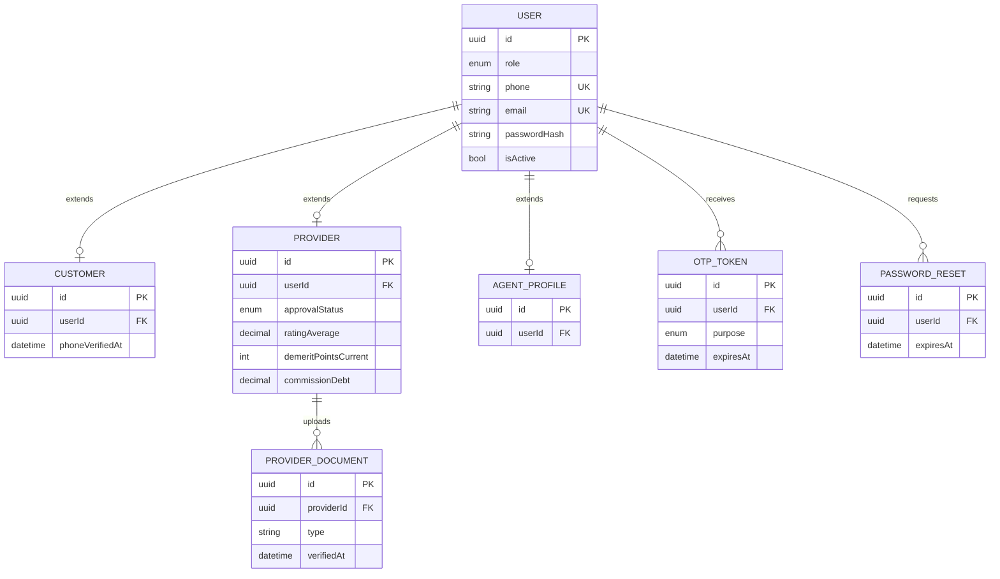
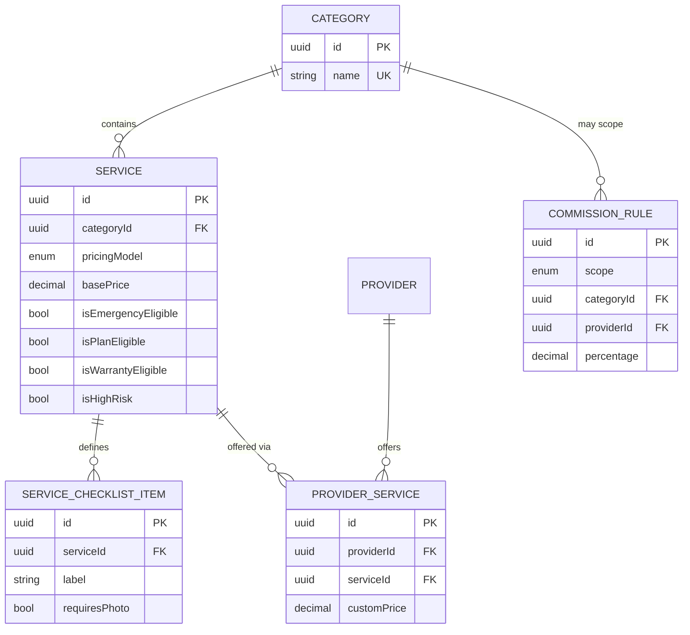
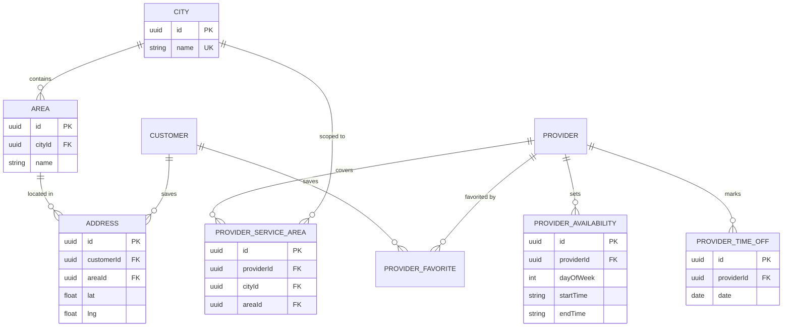

# Entity Relationship Diagram — Smart Home Maintenance Services

> **Superseded 2026-09-28 — see `../docs-final/ERD.md`.** This document's 50-model
> `schema.prisma` design (see line 4 below) was never adopted; the schema actually running is
> the 72-table `smart-home-docs/04_schema.sql`, which `docs-final/ERD.md` documents. Left here
> as historical record; do not treat this copy as current, and do not run `prisma migrate`
> against `schema.prisma` in this folder — see `docs-final/TRD.md` §2 for why (dbmate owns
> migrations, Prisma is client-only).

**Source:** SRS v2.0, Section 10 (Data Requirements) and the FR tables in Section 6.
**Implementation:** `schema.prisma` (delivered alongside this document) is the buildable,
authoritative version of everything diagrammed below — run `npx prisma migrate dev` against
it directly. PostgreSQL is the target database; Prisma is the ORM/migration tool.

The full model has ~35 entities across the 8 groups defined in SRS §10.1. One diagram that
size is unreadable, so it is split by group below, with the foreign keys that cross group
boundaries called out underneath each diagram. Every diagram renders natively in GitHub,
VS Code, and Cursor (Mermaid).

---

## 1. Identity — M2, M3, M12



`role` is a single enum on `User` (`CUSTOMER | PROVIDER | VERIFICATION_AGENT |
FINANCE_OFFICER | ADMIN`) rather than a separate roles/permissions table — five fixed
roles don't justify a many-to-many RBAC schema (FR-AD-13 permission *scoping* is handled
in the NestJS guard layer, see the TRD). `Customer`, `Provider` and `AgentProfile` are
1:1 extension tables so a `User` row is never duplicated across roles.

---

## 2. Catalogue — M1



`PROVIDER` here is the same entity as in diagram 1 — shown again only where it joins.

---

## 3. Place & Time — supports M4, M5



---

## 4. Jobs — M5, M6 (the booking state machine, SRS §5)

```mermaid
erDiagram
    CUSTOMER ||--o{ BOOKING : places
    PROVIDER ||--o{ BOOKING : fulfills
    SERVICE ||--o{ BOOKING : "booked for"
    ADDRESS ||--o{ BOOKING : "job site"
    BOOKING ||--o{ BOOKING_PHOTO : "problem photos"
    BOOKING ||--o{ BOOKING_STATUS_HISTORY : logs
    BOOKING ||--o{ JOB_EVIDENCE : "before/after"
    BOOKING ||--o{ JOB_CHECKLIST_RESULT : completes
    BOOKING ||--o{ QUOTE_REVISION : "extra work"
    BOOKING ||--o| INVOICE : generates
    INVOICE ||--o{ INVOICE_LINE : itemizes

    BOOKING {
        uuid id PK
        uuid customerId FK
        uuid providerId FK "nullable — auto-assign"
        uuid serviceId FK
        uuid addressId FK
        enum status
        enum paymentMode
        enum verificationTier
        datetime startOtpVerifiedAt
        datetime checkinAt
        datetime checkoutAt
        decimal finalAmount
    }
    BOOKING_STATUS_HISTORY {
        uuid id PK
        uuid bookingId FK
        enum fromStatus
        enum toStatus
        uuid actorUserId FK
        datetime createdAt
    }
    JOB_EVIDENCE {
        uuid id PK
        uuid bookingId FK
        enum type
        string url
    }
    JOB_CHECKLIST_RESULT {
        uuid id PK
        uuid bookingId FK
        string checklistItem
        bool isCompleted
    }
    QUOTE_REVISION {
        uuid id PK
        uuid bookingId FK
        decimal amount
        bool approvedByCustomer
    }
    INVOICE {
        uuid id PK
        uuid bookingId FK UK
        decimal totalAmount
    }
    INVOICE_LINE {
        uuid id PK
        uuid invoiceId FK
        enum type
        decimal lineTotal
    }
```

`Booking.status` is the ten-plus-branch state machine from SRS §5.2–5.3. Integrity rule
10.3-2 (`WORK_COMPLETED` requires `startOtpVerifiedAt` set) and 10.3-3 (`PAYMENT_RELEASED`
requires a qualifying verification outcome) are enforced in the service layer inside a
Prisma transaction, not by a DB CHECK constraint, because the second rule spans two tables
(`Booking` + `VerificationCall`).

---

## 5. Verification — M7 (the mechanism the whole SRS is built around)

```mermaid
erDiagram
    BOOKING ||--o| VERIFICATION_CALL : "queued for"
    AGENT_PROFILE ||--o{ VERIFICATION_CALL : places
    VERIFICATION_CALL ||--o{ VERIFICATION_CALL_ATTEMPT : logs
    VERIFICATION_CALL ||--o| RATING : "publishes iff outcome permits"

    VERIFICATION_CALL {
        uuid id PK
        uuid bookingId FK UK
        enum tier
        uuid agentId FK "null for Tier B"
        enum outcome
        bool consentToRelease
        bool extraChargeDemanded
        int quality
        int punctuality
        int conduct
        int cleanliness
        string remarkText
        datetime submittedAt "immutable once set"
    }
    VERIFICATION_CALL_ATTEMPT {
        uuid id PK
        uuid verificationCallId FK
        int attemptNumber
        enum channel
        enum result
    }
```

---

## 6. Money — M8 (escrow, ledger, payouts)

```mermaid
erDiagram
    BOOKING ||--o| PAYMENT : captures
    BOOKING ||--o{ LEDGER_ENTRY : records
    BOOKING ||--o{ REFUND : "may issue"
    PROVIDER ||--o| WALLET : holds
    PROVIDER ||--o{ PAYOUT : requests

    PAYMENT {
        uuid id PK
        uuid bookingId FK UK
        string gatewayRef UK
        decimal amount
        enum status
    }
    WALLET {
        uuid id PK
        uuid providerId FK UK
        decimal balance
        decimal heldBalance
    }
    LEDGER_ENTRY {
        uuid id PK
        uuid bookingId FK
        enum accountType
        uuid accountId
        enum direction
        decimal amount
        enum reason
        uuid relatedEntryId "pairs the double-entry"
    }
    PAYOUT {
        uuid id PK
        uuid providerId FK
        decimal amount
        enum status
    }
    REFUND {
        uuid id PK
        uuid bookingId FK
        decimal amount
    }
    COUPON {
        uuid id PK
        string code UK
        enum discountType
        decimal value
    }
```

`LedgerEntry` is append-only (Design Constraint §2.5; NFR-IN-03): every balance shown
anywhere in the product — wallet balance, escrow held, commission owed — is a `SUM()`
over this table, never a stored, editable column. `relatedEntryId` links the debit half
of a movement to its credit half so Integrity Rule 10.3-4 ("debits equal credits per
booking") can be checked with one query.

---

## 7. Trust & Conduct — M9, M10, M15

```mermaid
erDiagram
    VERIFICATION_CALL ||--o| RATING : "is the only source of"
    BOOKING ||--o| RATING : scores
    PROVIDER ||--o{ RATING : accumulates
    RATING ||--o| REMARK : carries
    BOOKING ||--o{ COMPLAINT : "may attach to"
    USER ||--o{ COMPLAINT : raises
    COMPLAINT ||--o{ COMPLAINT_EVENT : logs
    BOOKING ||--o| DISPUTE : escalates
    PROVIDER ||--o{ PENALTY : incurs
    BOOKING ||--o{ PENALTY : "may relate to"
    PENALTY ||--o{ DEMERIT_POINT : awards
    PROVIDER ||--o{ DEMERIT_POINT : accumulates

    RATING {
        uuid id PK
        uuid verificationCallId FK UK "not-null — enforces 10.3 rule 1"
        uuid bookingId FK UK
        uuid providerId FK
        decimal score
        bool isSuppressed
    }
    REMARK {
        uuid id PK
        uuid ratingId FK UK
        string text
        bool isPublished
        string providerReplyText
    }
    COMPLAINT {
        uuid id PK
        uuid bookingId FK
        uuid raisedByUserId FK
        uuid againstUserId FK
        enum severity
        enum status
    }
    DISPUTE {
        uuid id PK
        uuid bookingId FK UK
        enum status
        enum resolution
    }
    PENALTY {
        uuid id PK
        uuid providerId FK
        uuid bookingId FK
        string breachType
        enum category
        int points
        decimal financialAmount
        enum appealStatus
    }
    DEMERIT_POINT {
        uuid id PK
        uuid providerId FK
        uuid penaltyId FK
        int points
        datetime expiresAt
    }
```

The `Rating.verificationCallId` foreign key is required and unique — this is the single
schema-level rule Section 10.3 calls out as making every published rating trustworthy: a
`Rating` row cannot be inserted without a completed `VerificationCall`, so there is no
code path (buggy or malicious) that can fabricate one.

---

## 8. Platform — M11, M13, M14

```mermaid
erDiagram
    MAINTENANCE_PLAN ||--o{ MAINTENANCE_PLAN_SERVICE : includes
    SERVICE ||--o{ MAINTENANCE_PLAN_SERVICE : "eligible under"
    CUSTOMER ||--o{ SUBSCRIPTION : holds
    MAINTENANCE_PLAN ||--o{ SUBSCRIPTION : sold_as
    SUBSCRIPTION ||--o{ PLAN_ENTITLEMENT : grants
    BOOKING ||--o| PLAN_ENTITLEMENT : "consumes one"
    USER ||--o{ NOTIFICATION : receives
    NOTIFICATION_TEMPLATE ||--o{ NOTIFICATION : renders

    SUBSCRIPTION {
        uuid id PK
        uuid customerId FK
        uuid planId FK
        enum status
        int remainingVisits
    }
    PLAN_ENTITLEMENT {
        uuid id PK
        uuid subscriptionId FK
        uuid bookingId FK UK
        datetime usedAt
    }
    NOTIFICATION {
        uuid id PK
        uuid userId FK
        enum channel
        enum status
    }
    SETTING {
        uuid id PK
        string key UK
        json value
    }
    AUDIT_LOG {
        uuid id PK
        uuid actorUserId FK
        string action
        string entityType
        string entityId
    }
```

`Setting` and `AuditLog` have no incoming FKs from the domain tables — they're
cross-cutting (NFR-MA-01, NFR-IN-03) and referenced by `key`/`entityType`+`entityId`
rather than a typed relation, since `AuditLog.entityType` spans every table above.

---

## Cross-group foreign keys at a glance

| From | To | Why it crosses groups |
|---|---|---|
| `Booking.customerId` / `providerId` | Identity | every job ties back to its two parties |
| `Booking.serviceId` | Catalogue | pricing model and warranty flags travel with the booking |
| `Booking.addressId` | Place & Time | job-site location for the provider and for reporting |
| `VerificationCall.agentId` | Identity | which staff member is accountable for the call |
| `LedgerEntry.accountId` | Identity or a platform constant | polymorphic — resolved by `accountType`, not a typed FK |
| `Rating.providerId` | Identity | denormalized off `Booking→Provider` so profile queries don't join through Booking |
| `PlanEntitlement.bookingId` | Jobs | a plan visit is still an ordinary booking end-to-end |

## What's intentionally *not* separately modeled

- **`roles` / `permissions` tables** — five fixed roles; handled as an enum + NestJS guards.
- **`ratings` as a free-standing customer action** — FR-RT-03 explicitly forbids a direct
  in-app rating form, so there is no `POST /ratings` path in the API and no orphaned
  `Rating` rows are possible by construction (see the FK above).
- **A `payment_methods` / card-vault table** — card data is never persisted by this system;
  the gateway returns a token, and only `Payment.gatewayRef` is stored.
