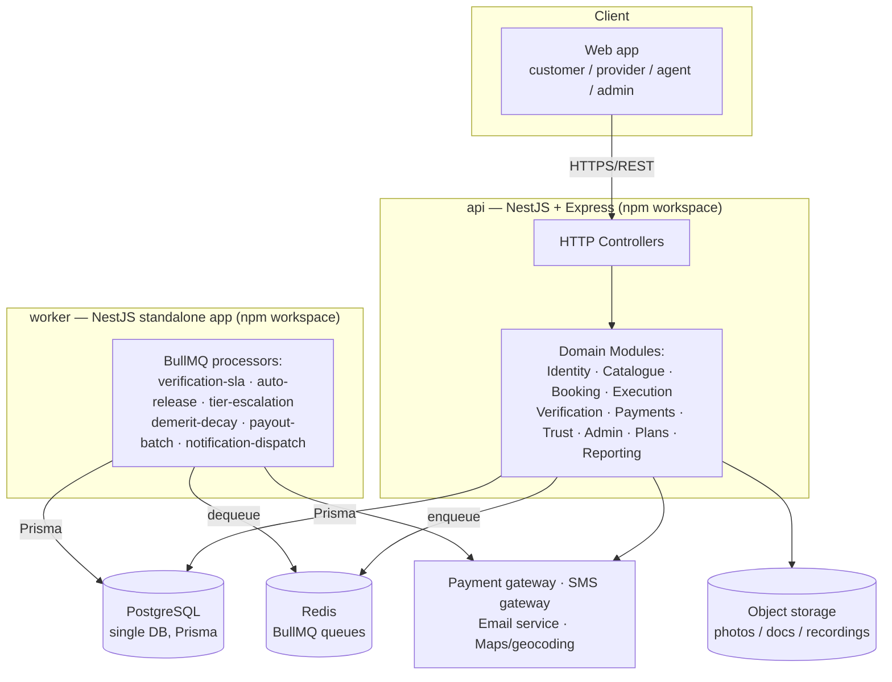

# Technical Requirements Document — Smart Home Maintenance Services

> **Superseded 2026-09-28 — see `../docs-final/TRD.md`.** This document was built from SRS
> v2.0, which turned out to be an *earlier* draft than `smart-home-docs/01_SRS_v2.1.md`
> (now `../docs-final/SRS.md`) despite the lower version number. `docs-final/TRD.md` is the
> corrected, current version. Left here as historical record; do not treat this copy as
> current.

**Source:** SRS v2.0. **Companion documents:** `ERD_Smart_Home_Maintenance.md`, `schema.prisma`.
**Stack given:** Node.js · NestJS (Express adapter) · PostgreSQL · SQL · Prisma · npm.

---

## 1. Technology stack

| Layer | Choice | Notes |
|---|---|---|
| Runtime | Node.js 20 LTS | |
| Framework | NestJS 10, `@nestjs/platform-express` | Express explicitly requested over the Fastify adapter NestJS also supports |
| Language | TypeScript (strict mode) | |
| Database | PostgreSQL 15+ | one instance for Phases 1–4 (§3) |
| ORM | Prisma 5 | schema-first; migrations via `prisma migrate` |
| Raw SQL | `Prisma.$queryRaw` / `$executeRaw` | for the handful of queries Prisma's query builder can't express cleanly (§6) |
| Package manager / monorepo | npm workspaces | one repo, multiple deployable apps — matches the workspace-per-app pattern already used on other projects |
| Auth | Passport-JWT (`@nestjs/passport`) | access + refresh tokens, role guards |
| Validation | `class-validator` + `class-transformer` | DTOs at every controller boundary |
| API docs | `@nestjs/swagger` | OpenAPI generated from decorators |
| Background jobs | BullMQ + Redis | SLA timers, auto-release, notification dispatch, payout batches |
| File storage | S3-compatible object storage (local disk in dev) | job photos, documents, call recordings |
| Containers | Docker + Docker Compose | `api`, `worker`, `postgres`, `redis` |

---

## 2. The microservices question

You asked for microservices "if needed." Here's the honest answer for this system.

**Recommendation: a modular monolith plus one separate worker process — not a full
microservices split.** Reasoning:

- The domain's hardest constraint is the **escrow ledger** (§2.5 of the SRS: every money
  movement in one DB transaction, double-entry, balances derived not stored). That
  constraint is trivial inside one Postgres database and one Prisma transaction, and
  becomes a distributed-transaction problem the moment `Payments` and `Bookings` live in
  separate databases owned by separate services. Nothing in the SRS's scale requirements
  (a few thousand bookings/day, ≤17 verification agents) justifies taking on that
  complexity.
- Splitting by SRS module (15 modules) would produce 15 tiny services with constant
  cross-service calls for every booking (`Booking` → `Catalogue`, `Verification`,
  `Payments`, `Trust`, `Notifications` all touch one job) — more network calls than the
  system has meaningful bottlenecks.
- What *does* genuinely benefit from running out-of-process is **long-running and
  time-scheduled work**: the 30-minute verification SLA timer, the 72-hour auto-release
  job, the 24-hour Tier B escalation, demerit-point decay, payout batch runs, and
  notification dispatch. These are queue-driven, don't need synchronous access to every
  table, and should not run inside the same event loop that's serving HTTP requests.

So the architecture is:



Both `api` and `worker` are separate npm-workspace packages, deployed and scaled
independently, but they share one `@app/prisma` workspace package (the generated Prisma
client + schema) and one Postgres database. This gets you the two things microservices
are actually for here — independent scaling of the request-serving process vs. the
job-processing process, and independent deployment — without paying for distributed
transactions you don't need.

### If you do need to go further later

If a future load requirement genuinely demands it (e.g. verification calling volume
outgrows one team, or a partner needs to consume `Payments` independently), the module
boundaries below are already drawn along service-shaped seams, so extraction is a matter
of moving a workspace package and giving it its own database, not a rewrite:

| Candidate service | SRS modules | Owns these tables | Talks to core via |
|---|---|---|---|
| `identity-svc` | M2, M3, M12 (auth/approval) | User, Customer, Provider, ProviderDocument | REST + JWT issued centrally |
| `catalogue-svc` | M1 | Category, Service, ProviderService, CommissionRule | REST (read-heavy, cacheable) |
| `booking-svc` | M4, M5, M6 | Booking, BookingStatusHistory, JobEvidence, Invoice | events: `booking.completed` |
| `verification-svc` | M7 | VerificationCall, VerificationCallAttempt | consumes `booking.completed`, emits `verification.outcome` |
| `payments-svc` | M8 | LedgerEntry, Wallet, Payment, Payout, Refund | consumes `verification.outcome`, owns the ledger exclusively |
| `trust-svc` | M9, M10, M15 | Rating, Remark, Complaint, Penalty, DemeritPoint | consumes `verification.outcome` |
| `notification-svc` | M11 | Notification, NotificationTemplate | consumes every domain event |
| `reporting-svc` | M14 | (read replica, no writes) | reads via replica, never the write path |

Under that split, `payments-svc` is the one service that must remain the single writer
to money — every other service *reacts* to a `verification.outcome` event rather than
writing ledger rows itself. That single rule is what keeps the double-entry invariant
intact across service boundaries if you ever get there.

---

## 3. Monorepo structure (npm workspaces)

```
smart-home-maintenance/
├── package.json                 # workspaces: ["apps/*", "packages/*"]
├── docker-compose.yml
├── apps/
│   ├── api/                     # NestJS + Express — the HTTP application
│   │   ├── src/
│   │   │   ├── modules/
│   │   │   │   ├── identity/         # M2, M3 — auth, profiles, documents
│   │   │   │   ├── catalogue/        # M1
│   │   │   │   ├── search/           # M4
│   │   │   │   ├── booking/          # M5
│   │   │   │   ├── execution/        # M6 — OTP, evidence, checklist, invoice
│   │   │   │   ├── verification/     # M7 — queue, agent console API
│   │   │   │   ├── payments/         # M8 — escrow, ledger, payouts
│   │   │   │   ├── trust/            # M9, M10, M15 — ratings, complaints, penalties
│   │   │   │   ├── notifications/    # M11 — enqueue only; sending happens in worker
│   │   │   │   ├── admin/            # M12
│   │   │   │   ├── plans/            # M13
│   │   │   │   └── reporting/        # M14 — read-only queries, some raw SQL
│   │   │   ├── common/               # guards, interceptors, filters, pipes
│   │   │   └── main.ts
│   │   └── package.json
│   └── worker/                  # NestJS standalone app — BullMQ processors
│       ├── src/
│       │   ├── processors/
│       │   │   ├── verification-sla.processor.ts
│       │   │   ├── auto-release.processor.ts
│       │   │   ├── tier-escalation.processor.ts
│       │   │   ├── demerit-decay.processor.ts
│       │   │   ├── payout-batch.processor.ts
│       │   │   └── notification-dispatch.processor.ts
│       │   └── main.ts
│       └── package.json
└── packages/
    ├── prisma/                  # schema.prisma + generated client, shared by both apps
    │   ├── schema.prisma
    │   └── package.json
    ├── contracts/                # shared DTOs / enums / event payload types
    └── integrations/             # gateway adapters (§7)
```

`packages/prisma` is built once and consumed by both `apps/api` and `apps/worker` as a
normal npm workspace dependency (`"@app/prisma": "*"`), so there is exactly one Prisma
schema and one generated client for the whole system — no drift between what the API
writes and what the worker reads.

---

## 4. NestJS module ↔ SRS module mapping

| NestJS module (`apps/api/src/modules/...`) | SRS modules | Key endpoints (indicative) |
|---|---|---|
| `identity` | M2, M3, M12 (auth slice) | `POST /auth/register`, `POST /auth/otp/verify`, `PATCH /providers/:id/documents` |
| `catalogue` | M1 | `GET /categories`, `POST /admin/services`, `PATCH /providers/:id/services` |
| `search` | M4 | `GET /services/:id/providers?area=&priceMax=&availableToday=` |
| `booking` | M5 | `POST /bookings`, `PATCH /bookings/:id/reschedule`, `PATCH /bookings/:id/cancel` |
| `execution` | M6 | `POST /bookings/:id/start-otp`, `POST /bookings/:id/evidence`, `POST /bookings/:id/complete` |
| `verification` | M7 | `GET /verification/queue`, `POST /verification/:bookingId/outcome` |
| `payments` | M8 | `POST /payments/capture`, `POST /payments/webhook` (gateway callback), `POST /providers/:id/payout` |
| `trust` | M9, M10, M15 | `GET /providers/:id/ratings`, `POST /complaints`, `POST /admin/penalties/:id/appeal` |
| `notifications` | M11 (enqueue side) | internal only — publishes to BullMQ, no public REST surface |
| `admin` | M12 | `POST /admin/providers/:id/approve`, `GET /admin/operations-board` |
| `plans` | M13 | `POST /plans/:id/subscribe`, `GET /subscriptions/:id/entitlements` |
| `reporting` | M14 | `GET /reports/revenue?month=`, `GET /reports/verification` |

Every controller method: DTO-validated input → a module-local service method wrapped in
a Prisma transaction where it touches more than one table → a typed response DTO. No
controller talks to Prisma directly.

---

## 5. Data access strategy

- **One Prisma schema, one Postgres database** for Phases 1–4 of the SRS's own
  implementation plan (§13). Phase 5 (`reporting`) reads from the primary in early
  development and is the first candidate to move to a read replica once report queries
  start competing with transactional traffic.
- **Multi-table invariants are enforced in the service layer inside `prisma.$transaction`**,
  not by trusting the caller to make two calls — e.g. moving a booking to
  `PAYMENT_RELEASED` and writing the paired `LedgerEntry` rows happen atomically or not
  at all.
- **The two rules the SRS calls out explicitly as database-level (§10.3)** are implemented
  as they're described: the `Rating.verificationCallId` foreign key is `NOT NULL` and
  `UNIQUE`, so no rating can exist without a completed verification call, by construction.
  `AuditLog` and `VerificationCall.submittedAt`-once-set are enforced by granting the
  application's DB role no `UPDATE`/`DELETE` privilege on those tables, in addition to the
  application-layer check.
- **Migrations**: `prisma migrate dev` in development, `prisma migrate deploy` in CI/CD,
  one migration history shared by `api` and `worker` since they share `packages/prisma`.

---

## 6. Where raw SQL earns its place over Prisma's query builder

Prisma covers the great majority of this system. Raw SQL (`$queryRaw`, tagged templates
to stay parameterized) is worth reaching for in exactly these spots:

1. **Ledger balance and reconciliation queries** (`FR-PY-06`, integrity rule 10.3-4) —
   summing debits/credits per account with a `HAVING SUM(debit) = SUM(credit)` check
   across the whole `ledger_entries` table is a reporting-style aggregate Prisma's
   builder doesn't express as cleanly as SQL.
2. **Distance-based search ranking** (`FR-SR-04`, `FR-SR-06`) — the haversine calculation
   (or a `PostGIS` `ST_DistanceSphere` if the extension is enabled) between the
   customer's address and each provider's base location, combined with the weighted
   ranking formula (rating, distance, completion rate, response speed, recency).
3. **Reporting aggregates** (M14) — monthly revenue by category, provider performance
   percentiles, verification SLA compliance — window functions and `GROUP BY ROLLUP` are
   more direct in SQL than assembled from multiple Prisma calls.

Everything else — CRUD, the booking state machine, verification records, complaints —
stays on the Prisma client for type safety and migration tracking.

---

## 7. Third-party integrations — ports & adapters

The SRS names four external dependencies (§2.1, §9.3): payment gateway, SMS gateway,
email service, mapping/geocoding. Each is wrapped behind an interface in
`packages/integrations` so the concrete provider (e.g. which payment gateway, which SMS
provider) can be swapped without touching domain modules, and so unit tests mock the
interface rather than an HTTP client:

```typescript
// packages/integrations/src/payment-gateway.port.ts
export interface PaymentGatewayPort {
  capture(bookingId: string, amount: number): Promise<{ gatewayRef: string }>;
  release(gatewayRef: string): Promise<void>;
  refund(gatewayRef: string, amount: number): Promise<void>;
}
```

This also matters for `FR-PY-09` (idempotent callbacks): the adapter's webhook handler
checks `Payment.gatewayRef` for an existing `CAPTURED`/`REFUNDED` row before acting, so a
duplicated gateway callback is a no-op rather than a double release.

---

## 8. Background jobs (the `worker` app)

| Job | Trigger | SRS reference |
|---|---|---|
| `verification-sla` | scheduled, every minute | flags bookings past the 30-minute contact SLA (§4.4) |
| `auto-release` | scheduled, every 15 min | releases payment at 72h with no reachable customer, suppresses rating (FR-VC-07) |
| `tier-escalation` | scheduled, every 15 min | escalates a Tier B job to Tier A after 24h with no response (FR-VC-12) |
| `demerit-decay` | daily cron | decays one point per 30 clean days, expires the rolling 180-day window (FR-PN-02) |
| `payout-batch` | fixed cycle (e.g. weekly cron) | produces the batch file and per-provider statements (FR-PY-08) |
| `notification-dispatch` | queue-driven, on every domain event | sends the actual email/SMS/WhatsApp, updates `Notification.status` |

All jobs are idempotent (safe to re-run if a worker restarts mid-job) and read/write
through the same `@app/prisma` client as the API.

---

## 9. Authentication & authorization

- **JWT access token** (short-lived, ~15 min) + **refresh token** (rotated, stored
  hashed), issued by `identity`.
- **`@Roles()` decorator + a single `RolesGuard`** enforced on every controller — five
  values matching `UserRole`. `FR-VC-10` (an agent can't verify a booking they're
  personally linked to) is an additional per-request check inside the `verification`
  service, not expressible as a static role guard.
- **Rate limiting** via `@nestjs/throttler` on `/auth/*` and `/otp/*` (`NFR-SE-06`).
- **Passwords**: Argon2 (`argon2` npm package) — `NFR-SE-01`.

---

## 10. Non-functional requirements → concrete implementation

| NFR | Implementation |
|---|---|
| NFR-SE-01 (password hashing) | Argon2id via the `argon2` package |
| NFR-SE-02 (server-side authz) | `RolesGuard` on every route; no client-trust checks |
| NFR-SE-03 (parameterized queries) | Prisma by default; raw SQL only via tagged templates, never string concatenation |
| NFR-SE-04 (CSRF/XSS) | `helmet`, `csurf` on state-changing form endpoints, output encoding at the frontend boundary |
| NFR-SE-05 (upload restrictions) | `multer` with MIME/size limits, files written outside the web root, served via signed URLs |
| NFR-SE-06 (rate limiting) | `@nestjs/throttler` |
| NFR-PR-01 (number masking) | in-app messaging (`FR-BK-07`) proxies through the platform; real numbers never returned in any DTO |
| NFR-PR-02 (recording retention) | recordings stored in object storage with a lifecycle policy; access restricted by role guard |
| NFR-IN-01/02 (transactions, idempotency) | `prisma.$transaction`; gateway callbacks keyed on `gatewayRef` |
| NFR-IN-03 (append-only audit log) | DB role has no `UPDATE`/`DELETE` grant on `audit_log`, `verification_calls` |
| NFR-PE-01/02 (search performance) | indexes on `(status)`, `(providerId, status)`, `(customerId)` already in `schema.prisma`; add a `GIST`/`PostGIS` index if geospatial queries grow |
| NFR-PE-03 (async dispatch) | BullMQ, decoupled from the request cycle |
| NFR-US-01/02 (mobile-first, Urdu RTL) | frontend concern; API returns locale-neutral data, no server-rendered text to translate |
| NFR-MA-01 (config not code) | the `Setting` table (`schema.prisma`), read through a cached `ConfigService` wrapper |

---

## 11. Testing & CI/CD

- **Unit tests**: Jest, one suite per NestJS service class, integration adapters mocked
  via the ports in §7.
- **Integration/e2e tests**: `@nestjs/testing` + a disposable Postgres (Docker) seeded via
  `prisma db seed`; cover the booking state machine and the verification-to-payment path
  end to end, since that's where correctness matters most.
- **CI**: on every PR — lint, typecheck, `prisma migrate diff` (catch drift), unit + e2e
  tests. On merge to main — `prisma migrate deploy` against staging, then a manual
  promote to production.

---

## 12. Deployment

`docker-compose.yml` services: `api`, `worker`, `postgres`, `redis`, and a reverse proxy
(`nginx` or the platform's own ingress) terminating TLS. Both `api` and `worker` build
from the same base image (`packages/prisma`'s generated client baked in at build time)
but run different entrypoints and can be scaled independently — more `api` replicas for
request throughput, more `worker` replicas if the verification/notification queues back
up.

---

## 13. Alignment with the SRS's own implementation plan (§13)

| SRS Phase | This TRD's build order |
|---|---|
| 1 — Foundation | `identity`, `catalogue`, `admin` modules; `packages/prisma` schema for those groups; JWT auth wired end-to-end |
| 2 — Transacting | `search`, `booking`, `execution` modules; the booking state machine; start-OTP, evidence, checklist, invoice |
| 3 — Verification and money | `verification` module + `verification-sla`/`auto-release`/`tier-escalation` worker jobs; `payments` module and the ledger; `trust` ratings (Rating FK constraint from day one) |
| 4 — Trust and communication | `trust` complaints/disputes/penalties; `notifications` module + `notification-dispatch` worker job |
| 5 — Depth | `plans` module; `reporting` module (raw SQL aggregates); `payout-batch` worker job |

This keeps the `worker` app's build order tied 1:1 to the phase that introduces the
timers it runs, so it's never built ahead of the domain logic it depends on.
